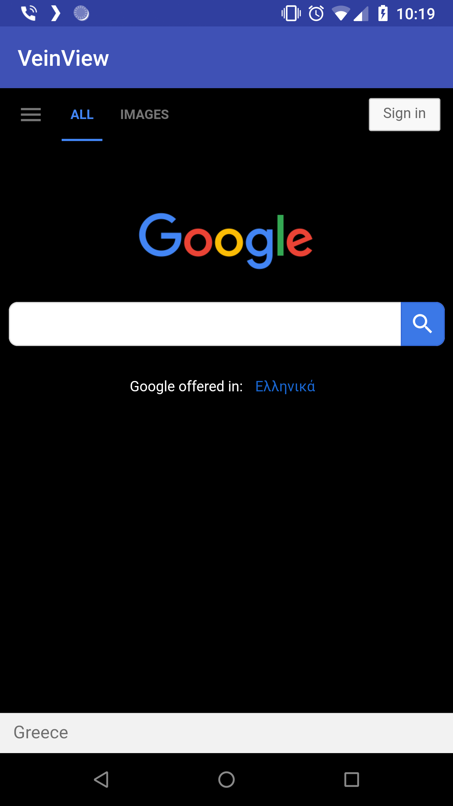

# VeinView

[](https://opensource.org/licenses/Apache-2.0)
[](https://dl.bintray.com/ifanie/izilib/com/izikode/izilib/veinview/0.2/)
[]( https://android-arsenal.com/details/1/7383 )

#### Custom WebView with build in CSS and JS injection capabilities
With VeinView you can easily inject CSS and JavaScript code into your WebView contents, and the enhance the user experience based on your individual needs.

You could apply a dark mode CSS and make Google look like this:



## Installation
```
implementation 'com.izikode.izilib:veinview:0.2'
```
## Usage
#### Use VeinView just like you would use a vanilla WebView.
```xml
<android.support.constraint.ConstraintLayout 
    xmlns:android="http://schemas.android.com/apk/res/android"
    android:layout_width="match_parent"
    android:layout_height="match_parent">

    <com.izikode.izilib.veinview.VeinView
        android:id="@+id/veinview"
        android:layout_width="match_parent"
        android:layout_height="match_parent" />

</android.support.constraint.ConstraintLayout>
```
#### Do any setup that you would normally do to your WebViews and before loading the contents, provide VeinView with a new Client; be careful to use a ```VeinViewClient``` and not a ```WebViewClient```.
```kotlin
veinView.setVeinViewClient(object: VeinViewClient() {
    override fun onReadyToInject(injector: VeinViewInjector, page: String) {

        injector.injectCSS(R.raw.dark_google_style)

    }
})
```
- Use the ```defaultClient``` DSL for an even simpler initialization.
```kotlin
veinView.setVeinViewClient(defaultClient { injector, page ->
    injector.injectCSS(R.raw.dark_google_style)
})
```
#### Use the provided ```VeinViewInjector``` to update the contents to your needs. You can inject a raw resource or plain String objects containing your CSS or JavaScript code. In the above screenshot, the following CSS style is used:
```css
body {
    color: white;
    background-color: black;
}
```
#### For a full example, see the sample app.

## Licence
```
Copyright 2018 Fanis Veizis

Licensed under the Apache License, Version 2.0 (the "License");
you may not use this file except in compliance with the License.
You may obtain a copy of the License at

    http://www.apache.org/licenses/LICENSE-2.0

Unless required by applicable law or agreed to in writing, software
distributed under the License is distributed on an "AS IS" BASIS,
WITHOUT WARRANTIES OR CONDITIONS OF ANY KIND, either express or implied.
See the License for the specific language governing permissions and
limitations under the License.
```
